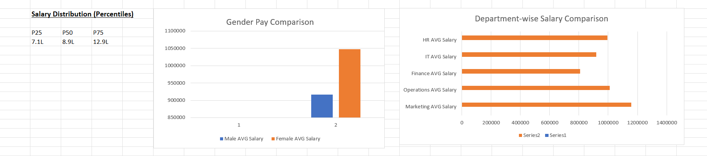

# Compensation & Pay Gap Analysis

## Overview

This project analyzes employee salary data to understand compensation distribution, pay differences, and trends across different groups.

## Objectives

* Analyze salary distribution using percentiles (P25, P50, P75)
* Identify gender-based pay differences
* Compare salary trends across departments
* Build a dashboard to visualize key insights

## Tools Used

* Excel (Data Cleaning, Analysis, Dashboard)

## Key Analysis

* Calculated salary percentiles to understand distribution
* Performed gender pay comparison using average salary
* Conducted department-wise salary analysis
* Built a dashboard to present insights clearly

## Dashboard

## Dataset

* Sample employee salary dataset (50 records)
* Includes fields like salary, gender, department, and experience

## Key Learnings

* Understanding compensation data structure
* Applying segmentation and comparison techniques
* Building business-focused dashboards in Excel
